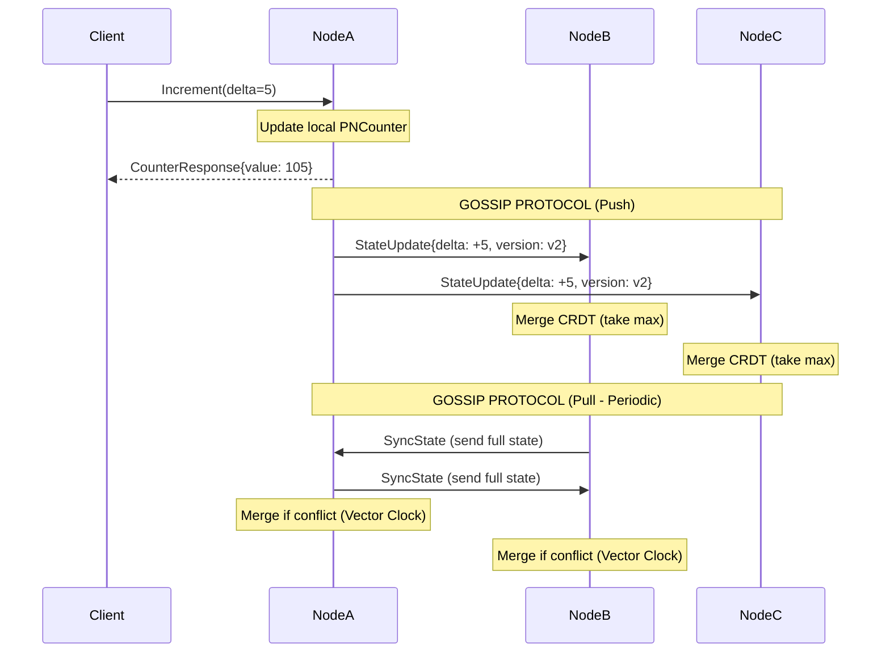

# Distributed Counter System with CRDT & gRPC

## 📋 Overview

Distributed Counter System adalah sistem counter terdistribusi yang memungkinkan multiple server nodes untuk saling menyinkronkan nilai counter secara real-time tanpa memerlukan koordinator pusat. Sistem ini mengimplementasikan **Conflict-free Replicated Data Type (CRDT)** dan **Gossip Protocol** untuk mencapai **eventual consistency**, dengan semua komunikasi antar node menggunakan **gRPC**.

### ✨ Key Features

| Feature | Description |
| :--- | :--- |
| **CRDT-based Counter** | Menggunakan `PNCounter` (Positive-Negative Counter) yang secara matematis dijamin conflict-free saat di-merge |
| **gRPC Communication** | Semua komunikasi antar node menggunakan gRPC (Unary, Server Streaming, dan Bidirectional Streaming) |
| **Gossip Protocol** | Node saling berbagi update state secara periodik untuk mencapai konsistensi eventual |
| **Service Discovery** | Node discovery dan membership management dengan heartbeat mechanism |
| **Fault Tolerance** | Sistem tetap berjalan meskipun beberapa node mati atau network partition terjadi |
| **Vector Clock** | Deteksi konflik menggunakan vector clock untuk menentukan urutan operasi |

---

## 🏗️ Architecture

### System Architecture Diagram

```
                    ┌──────────────────────────────────────────────┐
                    │         CLIENT APPLICATIONS                  │
                    │  (Mobile, Web, CLI, Other Services)          │
                    └──────────────────┬───────────────────────────┘
                                       │ gRPC Unary Calls
                                       ▼
┌──────────────────────────────────────────────────────────────────────────┐
│                          CLUSTER NODE (Node A)                           │
│  ┌──────────────────┐  ┌──────────────────┐  ┌──────────────────┐        │
│  │  gRPC Server     │  │  Counter Service │  │  CRDT (PNCounter)│        │
│  │  - API Layer     │◄─┤  - Increment()   │  │  - value         │        │
│  │  - Gossip Handler│  │  - Decrement()   │  │  - positive      │        │
│  │  - Heartbeat     │  │  - GetValue()    │  │  - negative      │        │
│  └────────┬─────────┘  └────────┬─────────┘  └────────┬─────────┘        │
│           │                     │                     │                  │
│           │       ┌─────────────┴─────────────────────┘                  │
│           │       │                                                      │
│           │       ▼                                                      │
│           │  ┌─────────────────────────────────────────┐                 │
│           └──►│   Gossip Engine (gRPC Bidirectional)   │                 │
│               │   - State Sync (Push & Pull)           │                 │
│               │   - Membership Management              │                 │
│               │   - Anti-Entropy Protocol              │                 │
│               └─────────────────┬──────────────────────┘                 │
└─────────────────────────────────┼────────────────────────────────────────┘
                                  │ gRPC Streaming
                                  ▼
                         ┌───────────────────┐
                         │  Other Nodes      │
                         │  (B, C, D, ...)   │
                         └───────────────────┘
```

### Communication Flow



---

## 🛠️ Technology Stack

| Technology | Version | Purpose |
| :--- | :--- | :--- |
| **Go** | 1.23+ | Main programming language |
| **gRPC** | 1.72.0 | RPC framework untuk komunikasi antar service |
| **Protocol Buffers** | 4.30.2 | Interface Definition Language (IDL) |
| **Redis** | 7.0+ | Optional: Persistent storage untuk state (stateful mode) |
| **PostgreSQL** | 15+ | Optional: Audit log dan history tracking |
| **Docker** | 24.0+ | Containerization |
| **Kubernetes** | 1.28+ | Orchestration (optional) |
| **Prometheus** | 2.45+ | Metrics collection |
| **Grafana** | 10.0+ | Dashboard & visualization |

### Go Libraries

| Library | Purpose |
| :--- | :--- |
| `google.golang.org/grpc` | gRPC implementation |
| `google.golang.org/protobuf` | Protobuf serialization |
| `github.com/spf13/viper` | Configuration management |
| `github.com/uber-go/zap` | Structured logging |
| `github.com/prometheus/client_golang` | Metrics export |
| `github.com/google/uuid` | UUID generation for node IDs |
| `github.com/hashicorp/memberlist` | Membership management (optional) |

---

## 📁 Project Structure

```
distributed-counter/
├── api/                 # API definitions
│   └── proto/           # gRPC Protobuf files
├── cmd/                 # Application entry points
│   └── server/          # Main server executable
├── internal/            # Private application code
│   ├── cluster/         # Node membership & discovery
│   ├── config/          # Configuration loader
│   ├── crdt/            # CRDT data structures
│   ├── gossip/          # Gossip protocol logic
│   ├── metrics/         # System metrics
│   ├── server/          # gRPC server setup
│   └── service/         # Core business logic
├── pkg/                 # Public, reusable libraries
│   ├── logger/          # Logging utilities
│   └── utils/           # Helper functions
├── configs/             # Default config files (YAML)
├── deployments/         # Deployment setups
│   └── kubernetes/      # K8s manifests & Dockerfiles
├── scripts/             # Automation & build scripts
└── test/                # Advanced testing
    ├── e2e/             # End-to-end tests
    └── integration/     # Integration tests
```

---

## 📈 Performance Benchmarks

| Scenario | Nodes | Operations/sec | Latency (p99) | Consistency |
| :--- | :--- | :--- | :--- | :--- |
| Single Node | 1 | 50,000 | 2ms | Strong |
| 3 Nodes | 3 | 15,000 | 5ms | Eventual (500ms) |
| 5 Nodes | 5 | 8,000 | 8ms | Eventual (1s) |
| 10 Nodes | 10 | 3,500 | 15ms | Eventual (2s) |

---

## 📚 References

- [CRDTs: The Basics](https://crdt.tech/)
- [gRPC Go Documentation](https://grpc.io/docs/languages/go/)
- [Gossip Protocol Explained](https://www.infoq.com/articles/gossip-protocols/)
- [Vector Clocks in Distributed Systems](https://en.wikipedia.org/wiki/Vector_clock)
- [PNCounter Specification](https://hal.inria.fr/inria-00555588/document)

---

## 🤝 Contributing

1. Fork the repository
2. Create your feature branch (`git checkout -b feature/amazing-feature`)
3. Commit your changes (`git commit -m 'Add some amazing feature'`)
4. Push to the branch (`git push origin feature/amazing-feature`)
5. Open a Pull Request

---

## 📄 License

This project is licensed under the MIT License - see the [LICENSE](LICENSE) file for details.

---

## 🌟 Acknowledgments

- Inspired by distributed systems challenges at companies like Facebook, Twitter, and Google
- Built with 💖 and ☕️ (lots of coffee)