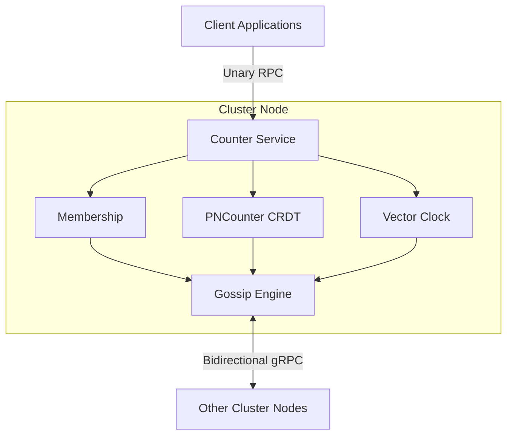
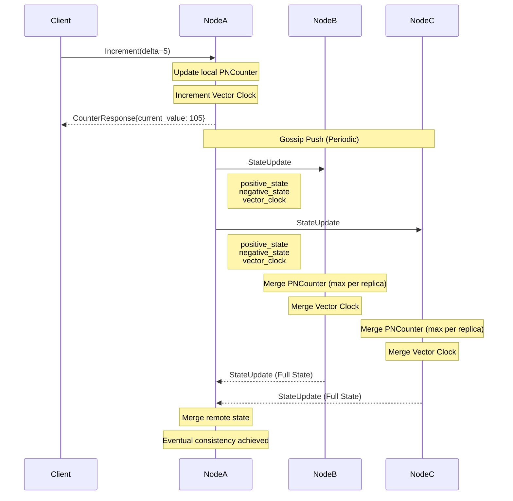
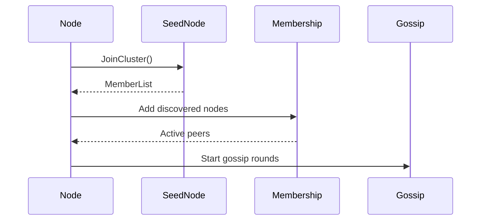

# Distributed Counter System with CRDT & gRPC

## Overview

Distributed Counter System adalah sistem counter terdistribusi yang memungkinkan multiple server nodes saling menyinkronkan nilai counter secara real-time tanpa memerlukan koordinator pusat. Sistem ini mengimplementasikan **Conflict-free Replicated Data Type (CRDT)** dan **Gossip Protocol** untuk mencapai **eventual consistency**, dengan semua komunikasi antar node menggunakan **gRPC**.

Sistem menggunakan:

* State-based **PNCounter CRDT**
* **Vector Clock** untuk causal ordering
* **Bidirectional gRPC Streaming** untuk sinkronisasi state
* **Gossip Protocol** untuk anti-entropy synchronization

---

## Features

| Feature               | Description                                                         |
| --------------------- | ------------------------------------------------------------------- |
| CRDT-based Counter    | Menggunakan state-based `PNCounter` yang conflict-free              |
| gRPC Communication    | Unary RPC, Server Streaming, dan Bidirectional Streaming            |
| Gossip Protocol       | Sinkronisasi state secara periodik antar node                       |
| Service Discovery     | Bootstrap node menggunakan seed nodes                               |
| Membership Management | Tracking active node dengan heartbeat                               |
| Vector Clock          | Deteksi causal ordering dan conflict                                |
| Fault Tolerance       | Tetap berjalan meskipun terjadi node failure atau network partition |
| Prometheus Metrics    | Monitoring counter dan aktivitas gossip                             |

---

# Architecture

## System Architecture



---

## Counter Synchronization Flow



---

## Internal Data Flow


---

## Cluster Bootstrap Flow



---

# Technology Stack

| Technology       | Version | Purpose                   |
| ---------------- | ------- | ------------------------- |
| Go               | 1.23+   | Main programming language |
| gRPC             | 1.72+   | RPC communication         |
| Protocol Buffers | 4.x     | Service definitions       |
| Docker           | 24+     | Containerization          |
| Prometheus       | 2.45+   | Metrics                   |
| Grafana          | 10+     | Dashboard                 |

---

## Go Libraries

| Library                             | Purpose                  |
| ----------------------------------- | ------------------------ |
| google.golang.org/grpc              | gRPC implementation      |
| google.golang.org/protobuf          | Protobuf serialization   |
| github.com/spf13/viper              | Configuration management |
| go.uber.org/zap                     | Structured logging       |
| github.com/prometheus/client_golang | Metrics export           |

---

# Project Structure

```text
distributed-counter/
├── api/
│   └── proto/
│       ├── counter.proto
│       ├── counter.pb.go
│       └── counter_grpc.pb.go
├── cmd/
│   └── server/
├── internal/
│   ├── cluster/
│   ├── config/
│   ├── crdt/
│   ├── gossip/
│   ├── metrics/
│   ├── server/
│   └── service/
├── pkg/
│   ├── logger/
│   └── utils/
├── configs/
├── deployments/
├── scripts/
└── test/
```

---

# Getting Started

## Prerequisites

Install:

* Go 1.23+
* Protocol Buffers Compiler (`protoc`)
* Docker and Docker Compose (optional)

Verify installation:

```bash
go version
protoc --version
docker --version
docker compose version
```

---

# Install Protobuf Plugins

```bash
go install google.golang.org/protobuf/cmd/protoc-gen-go@latest
go install google.golang.org/grpc/cmd/protoc-gen-go-grpc@latest
```

Linux/macOS:

```bash
export PATH="$PATH:$(go env GOPATH)/bin"
```

Windows PowerShell:

```powershell
$env:Path += ";$(go env GOPATH)\bin"
```

---

# Generate Protobuf Files

Whenever `counter.proto` changes, regenerate the generated files.

Linux/macOS:

```bash
protoc \
  --go_out=. \
  --go-grpc_out=. \
  api/proto/counter.proto
```

Windows CMD:

```cmd
protoc ^
  --go_out=. ^
  --go-grpc_out=. ^
  api/proto/counter.proto
```

Generated files:

```text
api/proto/
├── counter.pb.go
└── counter_grpc.pb.go
```

---

# Configuration

## Node 1

```yaml
node_id: node1
grpc_port: 50051

seed_nodes:
  - localhost:50052
  - localhost:50053
```

## Node 2

```yaml
node_id: node2
grpc_port: 50052

seed_nodes:
  - localhost:50051
  - localhost:50053
```

## Node 3

```yaml
node_id: node3
grpc_port: 50053

seed_nodes:
  - localhost:50051
  - localhost:50052
```

---

# Running Locally

## Terminal 1

```bash
go run ./cmd/server --config configs/node1.yaml
```

## Terminal 2

```bash
go run ./cmd/server --config configs/node2.yaml
```

## Terminal 3

```bash
go run ./cmd/server --config configs/node3.yaml
```

---

# Docker

## Build Image

```bash
docker build -t distributed-counter .
```

---

## Run Single Node

```bash
docker run \
  -p 50051:50051 \
  distributed-counter
```

---

# Docker Compose Cluster

Create:

```text
deployments/docker-compose.yml
```

```yaml
version: "3.9"

services:
  node1:
    build: .
    container_name: node1
    command:
      - --config
      - configs/node1.yaml
    ports:
      - "50051:50051"

  node2:
    build: .
    container_name: node2
    command:
      - --config
      - configs/node2.yaml
    ports:
      - "50052:50052"

  node3:
    build: .
    container_name: node3
    command:
      - --config
      - configs/node3.yaml
    ports:
      - "50053:50053"
```

Start cluster:

```bash
docker compose up --build
```

Run in background:

```bash
docker compose up -d --build
```

Stop cluster:

```bash
docker compose down
```


---

# Development Workflow

## Update Dependencies

```bash
go mod tidy
```

---

## Regenerate Protobuf Files

Jalankan langkah ini setiap kali `api/proto/counter.proto` berubah.

### Linux/macOS

```bash
protoc \
  --go_out=. \
  --go-grpc_out=. \
  api/proto/counter.proto
```

### Windows CMD

```cmd
protoc ^
  --go_out=. ^
  --go-grpc_out=. ^
  api/proto/counter.proto
```

### Verify Generated Files

```bash
ls api/proto/
```

Expected:

```text
counter.proto
counter.pb.go
counter_grpc.pb.go
```

---

## Rebuild Docker Images

```bash
docker compose -f deployments/docker-compose.yml down
docker compose -f deployments/docker-compose.yml build --no-cache
docker compose -f deployments/docker-compose.yml up -d
```

---

## Verify Containers

```bash
docker compose -f deployments/docker-compose.yml ps
```

View logs:

```bash
docker compose -f deployments/docker-compose.yml logs -f
```

---

## Wait for Cluster Initialization

Linux/macOS:

```bash
sleep 5
```

Windows PowerShell:

```powershell
timeout /t 5
```

---

## Run Integration Tests

```bash
go test -v ./test/integration/cluster_test.go
```

---

## Run End-to-End Tests

```bash
go test -v ./test/e2e/cluster_test.go
```

---

## Check Metrics

If metrics endpoint is enabled:

```bash
curl http://localhost:8080/metrics
```

Windows PowerShell:

```powershell
Invoke-WebRequest http://localhost:8080/metrics
```

---

## Stop Cluster

```bash
docker compose -f deployments/docker-compose.yml down
```

---


# Metrics

Prometheus metrics:

| Metric                         | Description                    |
| ------------------------------ | ------------------------------ |
| counter_increment_total        | Total increment operations     |
| counter_decrement_total        | Total decrement operations     |
| counter_current_value          | Current counter value          |
| gossip_messages_sent_total     | Total gossip messages sent     |
| gossip_messages_received_total | Total gossip messages received |

---

# Consistency Model

This project implements:

* State-based PNCounter CRDT
* Vector Clock
* Gossip Protocol
* Eventual Consistency

Properties:

* No leader election required
* No central coordinator required
* Partition tolerant
* Conflict-free merge semantics

---

# Performance Benchmarks

| Scenario    | Nodes | Operations/sec | Latency (p99) | Consistency       |
| ----------- | ----- | -------------- | ------------- | ----------------- |
| Single Node | 1     | 50,000         | 2ms           | Strong            |
| 3 Nodes     | 3     | 15,000         | 5ms           | Eventual (~500ms) |
| 5 Nodes     | 5     | 8,000          | 8ms           | Eventual (~1s)    |
| 10 Nodes    | 10    | 3,500          | 15ms          | Eventual (~2s)    |

---

# References

* https://crdt.tech/
* https://grpc.io/docs/languages/go/
* https://www.infoq.com/articles/gossip-protocols/
* https://en.wikipedia.org/wiki/Vector_clock
* https://hal.inria.fr/inria-00555588/document

---

# Contributing

1. Fork repository.

2. Create feature branch.

```bash
git checkout -b feature/my-feature
```

3. Commit changes.

```bash
git commit -m "feat: add new feature"
```

4. Push branch.

```bash
git push origin feature/my-feature
```

5. Open Pull Request.

---

# License

This project is licensed under the MIT License.

---

# Acknowledgments

Inspired by distributed systems concepts used in large-scale systems at companies such as Google, Facebook, and Twitter.

Built with Go, gRPC, CRDT, and distributed systems concepts.
