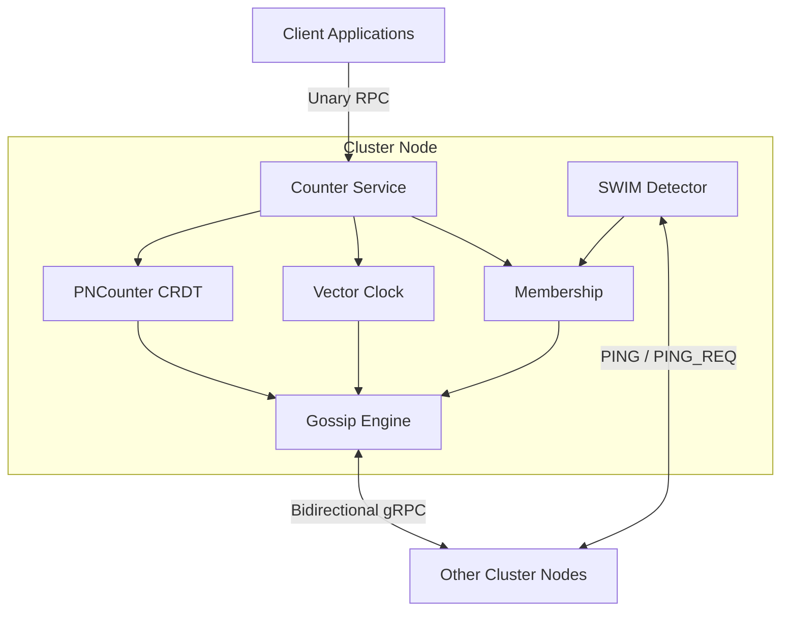
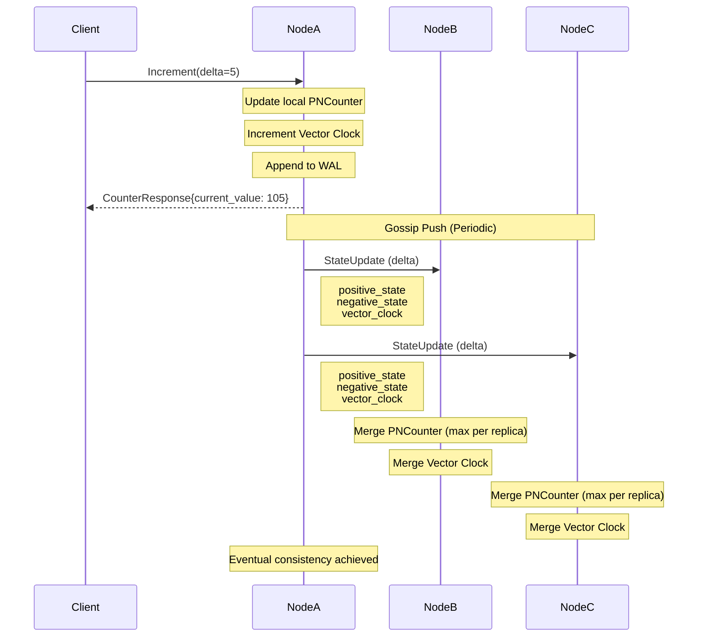
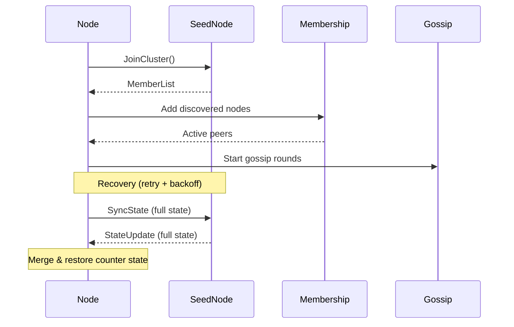
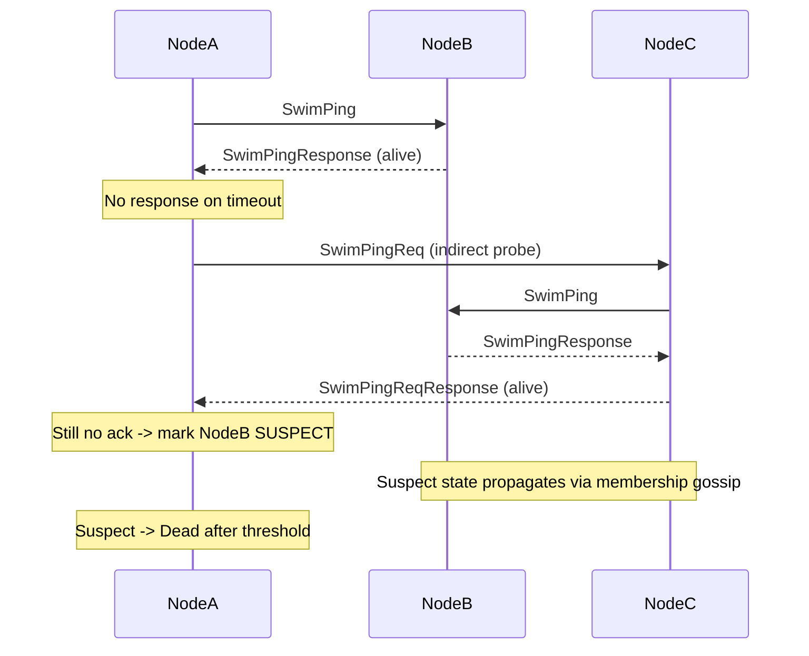
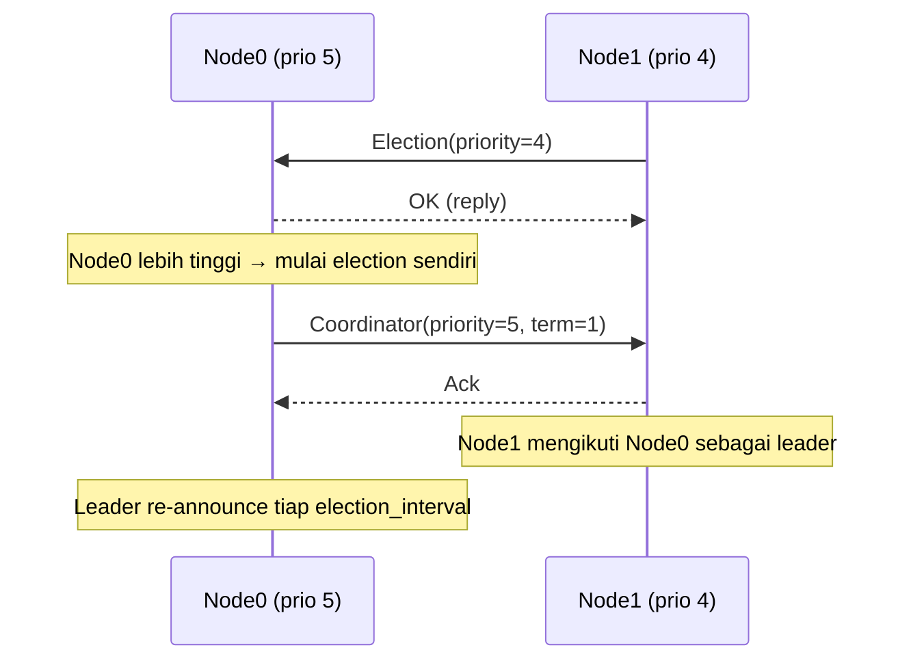

# Distributed Counter System with CRDT & gRPC

## Overview

Distributed Counter System adalah sistem counter terdistribusi yang memungkinkan multiple server nodes saling menyinkronkan nilai counter secara real-time tanpa memerlukan koordinator pusat. Sistem ini mengimplementasikan **Conflict-free Replicated Data Type (CRDT)** dan **Gossip Protocol** untuk mencapai **eventual consistency**, dengan semua komunikasi antar node menggunakan **gRPC**.

Sistem menggunakan:

* State-based **PNCounter CRDT**
* **Vector Clock** untuk causal ordering
* **Bidirectional gRPC Streaming** untuk sinkronisasi state
* **Gossip Protocol** untuk anti-entropy synchronization
* **SWIM** untuk failure detection
* **Write-Ahead Log (WAL)** + snapshot untuk durability
* **OpenTelemetry** untuk distributed tracing

---

## Features

| Feature                  | Description                                                                    |
| ------------------------ | ------------------------------------------------------------------------------ |
| CRDT-based Counter       | Menggunakan state-based `PNCounter` yang conflict-free                         |
| gRPC Communication       | Unary RPC, Server Streaming, dan Bidirectional Streaming                        |
| Gossip Protocol          | Sinkronisasi state secara periodik antar node                                  |
| Delta Gossip             | Hanya mengirim perubahan (delta) antar node, bukan full state                  |
| Versioned State          | Melacak `LastSyncVersion` per peer agar tidak mengirim state ganda             |
| Full-state Reconciliation| Kirim full state secara berkala sebagai jaring pengaman konsistensi            |
| Circuit Breaker          | Mencegah node mati dipukul terus pada setiap gossip round                      |
| SWIM Failure Detection   | Deteksi kegagalan dengan `PING`, `PING_REQ`, `ACK` dan status Suspect/Dead     |
| Membership Management    | Tracking lifecycle node (Alive/Suspect/Dead/Left) dengan heartbeat             |
| Service Discovery        | Bootstrap node menggunakan seed nodes                                          |
| State Recovery           | Pull state dari seed nodes saat startup dengan retry & backoff                 |
| Vector Clock             | Deteksi causal ordering dan conflict                                           |
| Fault Tolerance          | Tetap berjalan meskipun terjadi node failure atau network partition            |
| State Persistence        | Simpan state CRDT ke Redis agar counter survive restart                        |
| Write-Ahead Log          | Mutasi ditulis ke WAL sebelum diterapkan; di-replay saat restart               |
| Periodic Snapshots       | Snapshot berkala memangkas WAL agar tetap bounded                              |
| Reset RPC                | Reset counter untuk testing yang deterministik                                 |
| Authentication           | Proteksi RPC dengan API key (interceptor)                                     |
| Rate Limiting            | Batasi jumlah request per detik per method                                     |
| gRPC Compression         | Kompresi payload dengan gzip untuk menghemat bandwidth                         |
| Prometheus Metrics       | Monitoring counter, gossip, recovery, auth, dan rate limit                     |
| Distributed Tracing      | OpenTelemetry (OTLP) -> Jaeger, trace menyebar lintas node                     |
| Multi Counter            | Banyak counter independen dalam satu cluster, dinamespasi per `name`           |
| Tagged Counters          | Filter dan kategorisasi counter via tags                                        |
| Counter Sharding         | Distribusi counter ke shard (FNV-1a hash) untuk penyebaran beban               |
| Leader Election          | Bully algorithm memilih node ber-priority tertinggi sebagai leader             |
| REST Gateway             | grpc-gateway: akses RPC via HTTP/JSON (tiap node, port `http_port`)            |
| Admin API                | RPC admin: AddNode / RemoveNode / ForceSync untuk manajemen cluster            |
| Web Dashboard            | Halaman HTML real-time: topologi cluster, nilai counter, gossip traffic        |
| Kubernetes Deployment    | Manifest StatefulSet + Service + Redis untuk deploy ke k8s                     |
| Network Partition Test   | Verifikasi eventual consistency saat cluster terbelah lalu pulih                |
| Chaos Testing            | Simulasi restart container / node di dalam proses dan via Docker               |
| Benchmark Suite          | Ukur throughput, convergence time, dan memori untuk 3/5/10/20 node            |
| Health Check             | gRPC health service + server reflection                                        |

---

# Architecture

## System Architecture


```mermaid
flowchart TD
    Client[Client Applications]

    Client -->|Unary RPC| CounterService

    subgraph Node["Cluster Node"]
        CounterService[Counter Service]

        CounterService --> PNCounter[PNCounter CRDT]
        CounterService --> VectorClock[Vector Clock]
        CounterService --> Membership[Membership]

        Membership --> Gossip[Gossip Engine]
        PNCounter --> Gossip
        VectorClock --> Gossip
        SWIM[SWIM Detector] --> Membership
    end

    Gossip <-->|Bidirectional gRPC| OtherNodes[Other Cluster Nodes]
    SWIM <-->|PING / PING_REQ| OtherNodes
```

---

## Counter Synchronization Flow


```mermaid
sequenceDiagram
    participant Client
    participant NodeA
    participant NodeB
    participant NodeC

    Client->>NodeA: Increment(delta=5)

    Note over NodeA: Update local PNCounter
    Note over NodeA: Increment Vector Clock
    Note over NodeA: Append to WAL

    NodeA-->>Client: CounterResponse{current_value: 105}

    Note over NodeA,NodeC: Gossip Push (Periodic)

    NodeA->>NodeB: StateUpdate (delta)
    Note right of NodeA: positive_state<br/>negative_state<br/>vector_clock

    NodeA->>NodeC: StateUpdate (delta)
    Note right of NodeA: positive_state<br/>negative_state<br/>vector_clock

    Note over NodeB: Merge PNCounter (max per replica)
    Note over NodeB: Merge Vector Clock

    Note over NodeC: Merge PNCounter (max per replica)
    Note over NodeC: Merge Vector Clock

    Note over NodeA: Eventual consistency achieved
```

---

## Internal Data Flow


```mermaid
flowchart LR
    A[Increment or Decrement] --> B[Update PNCounter]
    B --> C[Increment Vector Clock]
    C --> D[Append WAL]
    D --> E[Create StateUpdate]
    E --> F[Send via gRPC]
    F --> G[Remote Node]
    G --> H[Merge PNCounter]
    H --> I[Merge Vector Clock]
    I --> J[Eventual Consistency]
```

---

## Cluster Bootstrap & Recovery Flow


```mermaid
sequenceDiagram
    participant Node
    participant SeedNode
    participant Membership
    participant Gossip

    Node->>SeedNode: JoinCluster()
    SeedNode-->>Node: MemberList

    Node->>Membership: Add discovered nodes
    Membership-->>Node: Active peers

    Node->>Gossip: Start gossip rounds

    Note over Node,SeedNode: Recovery (retry + backoff)
    Node->>SeedNode: SyncState (full state)
    SeedNode-->>Node: StateUpdate (full state)
    Note over Node: Merge & restore counter state
```

---

## Failure Detection Flow (SWIM)


```mermaid
sequenceDiagram
    participant NodeA
    participant NodeB
    participant NodeC

    NodeA->>NodeB: SwimPing
    NodeB-->>NodeA: SwimPingResponse (alive)

    Note over NodeA: No response on timeout
    NodeA->>NodeC: SwimPingReq (indirect probe)
    NodeC->>NodeB: SwimPing
    NodeB-->>NodeC: SwimPingResponse
    NodeC-->>NodeA: SwimPingReqResponse (alive)

    Note over NodeA: Still no ack -> mark NodeB SUSPECT
    Note over NodeB,NodeC: Suspect state propagates via membership gossip
    Note over NodeA: Suspect -> Dead after threshold
```

---

# Technology Stack

| Technology       | Version   | Purpose                    |
| ---------------- | --------- | -------------------------- |
| Go               | 1.25+     | Main programming language  |
| gRPC             | 1.83      | RPC communication          |
| Protocol Buffers | 4.x       | Service definitions        |
| Redis            | 7.x       | State persistence          |
| Prometheus       | 2.45+     | Metrics                    |
| Grafana          | 10+       | Dashboard                  |
| Jaeger           | 1.57      | Distributed tracing (UI)   |
| OpenTelemetry    | 1.45      | Tracing SDK & OTLP export  |
| Docker           | 24+       | Containerization           |

---

## Go Libraries

| Library                                                            | Purpose                      |
| ------------------------------------------------------------------ | ---------------------------- |
| google.golang.org/grpc                                             | gRPC implementation          |
| google.golang.org/protobuf                                         | Protobuf serialization       |
| github.com/spf13/viper                                             | Configuration management     |
| go.uber.org/zap                                                    | Structured logging           |
| github.com/prometheus/client_golang                                | Metrics export               |
| github.com/redis/go-redis/v9                                       | Redis client                 |
| go.opentelemetry.io/otel                                           | OpenTelemetry SDK            |
| go.opentelemetry.io/otel/exporters/otlp/otlptrace/otlptracegrpc    | OTLP gRPC trace exporter     |
| go.opentelemetry.io/contrib/instrumentation/google.golang.org/grpc | gRPC tracing instrumentation |
| github.com/grpc-ecosystem/grpc-gateway/v2                          | REST gateway (HTTP/JSON)     |

---

# Project Structure

```text
distributed-counter/
├── api/
│   └── proto/
│       ├── counter.proto
│       ├── counter.pb.go
│       ├── counter_grpc.pb.go
│       └── counter.pb.gw.go   # grpc-gateway stubs
├── cmd/
│   └── server/
│       └── main.go
├── internal/
│   ├── admin/          # AdminService RPC handlers (AddNode/RemoveNode/ForceSync)
│   ├── cluster/        # Membership + SWIM failure detector
│   ├── config/         # Viper-based configuration
│   ├── crdt/           # PNCounter + Vector Clock (multi-counter aware)
│   ├── dashboard/      # Web dashboard (HTML embedded + /api/cluster)
│   ├── election/       # Bully leader election
│   ├── gateway/        # grpc-gateway HTTP server (REST + dashboard + admin)
│   ├── gossip/         # Gossip engine (delta/full sync, circuit breaker)
│   ├── metrics/        # Prometheus metrics
│   ├── persistence/    # Redis store + Write-Ahead Log
│   ├── server/         # gRPC server (auth, rate limit, health, reflection)
│   ├── service/        # Counter service RPC handlers
│   └── tracing/        # OpenTelemetry init (OTLP -> Jaeger)
├── pkg/
│   ├── grpcutil/       # Shared dial options (auth, compression, tracing)
│   └── logger/
├── third_party/        # google/api protos untuk grpc-gateway codegen
├── configs/
├── deployments/        # Dockerfile, compose, prometheus, grafana, k8s
├── scripts/
└── test/
    ├── benchmark/      # Throughput, convergence, memory benchmarks
    ├── chaos/          # In-process + Docker chaos tests
    ├── e2e/
    ├── election/       # Bully leader election tests
    ├── harness/        # In-process cluster harness
    ├── integration/
    ├── multicounter/   # Multi counter / tags / sharding tests
    └── partition/      # Network partition tests
```

---

# Getting Started

## Prerequisites

Install:

* Go 1.25+
* Protocol Buffers Compiler (`protoc`)
* Docker and Docker Compose (optional)

Verify installation:

```bash
go version
protoc --version
docker --version
docker compose version
```

---

# Install Protobuf Plugins

```bash
go install google.golang.org/protobuf/cmd/protoc-gen-go@latest
go install google.golang.org/grpc/cmd/protoc-gen-go-grpc@latest
go install github.com/grpc-ecosystem/grpc-gateway/v2/protoc-gen-grpc-gateway@latest
```

Linux/macOS:

```bash
export PATH="$PATH:$(go env GOPATH)/bin"
```

Windows PowerShell:

```powershell
$env:Path += ";$(go env GOPATH)\bin"
```

---

# Generate Protobuf Files

Whenever `counter.proto` changes, regenerate the generated files.

Linux/macOS:

```bash
protoc \
  -I api/proto -I third_party \
  --go_out=. --go_opt=paths=source_relative \
  --go-grpc_out=. --go-grpc_opt=paths=source_relative \
  --grpc-gateway_out=. --grpc-gateway_opt=paths=source_relative \
  api/proto/counter.proto
```

Windows CMD:

```cmd
protoc ^
  -I api/proto -I third_party ^
  --go_out=. --go_opt=paths=source_relative ^
  --go-grpc_out=. --go-grpc_opt=paths=source_relative ^
  --grpc-gateway_out=. --grpc-gateway_opt=paths=source_relative ^
  api/proto/counter.proto
```

Generated files:

```text
api/proto/
├── counter.pb.go
├── counter_grpc.pb.go
└── counter.pb.gw.go
```

---

# Configuration

Konfigurasi di-load dari file YAML (misal `configs/node1.yaml`). Log level dapat di-set via environment variable `COUNTER_LOG_LEVEL` (contoh: `debug`).

```yaml
# Identity
node_id: node-a
grpc_port: 50051
advertise_address: node-a:50051

# Metrics & HTTP
metrics_port: 8080
http_port: 8081              # REST gateway + dashboard (grpc-gateway)

# Gossip & heartbeat
gossip_interval: 5            # detik antar gossip round
heartbeat_interval: 3         # detik antar heartbeat
heartbeat_timeout: 10         # detik sebelum node dianggap stale

# Persistence (Redis)
persistence_enabled: true
redis_addr: redis:6379
redis_password: ""
redis_db: 0

# Write-Ahead Log & snapshots
wal_enabled: true
wal_dir: data
snapshot_interval_seconds: 30

# SWIM failure detection
swim_interval: 1              # protocol period (detik)
swim_probe_timeout: 2         # timeout direct/indirect probe (detik)
swim_suspect_to_dead: 3       # jumlah probe gagal sebelum Suspect -> Dead

# Production features
auth_enabled: false           # true untuk menyalakan API key
api_key: ""                   # key yang harus dikirim client
rate_limit_per_second: 0      # 0 = unlimited
compression_enabled: true     # gzip pada payload gRPC

# Distributed tracing (OpenTelemetry -> Jaeger)
tracing_enabled: true
trace_endpoint: jaeger:4317   # OTLP gRPC collector
trace_sample_ratio: 1.0       # 0.0 - 1.0

# Bootstrap
seed_nodes:
  - node-b:50052
  - node-c:50053

# Multi counter & sharding
counter_shards: 3             # jumlah shard untuk distribusi counter

# Leader election (bully)
node_priority: 1              # makin besar, makin berhak jadi leader
election_interval: 2          # detik, interval evaluasi/re-announce leader
```

### Node 1 (`configs/node1.yaml`)

```yaml
node_id: node-a
grpc_port: 50051
advertise_address: node-a:50051
metrics_port: 8080
http_port: 8081

seed_nodes:
  - node-b:50052
  - node-c:50053
```

### Node 2 (`configs/node2.yaml`)

```yaml
node_id: node-b
grpc_port: 50052
advertise_address: node-b:50052
metrics_port: 8081
http_port: 8082

seed_nodes:
  - node-a:50051
  - node-c:50053
```

### Node 3 (`configs/node3.yaml`)

```yaml
node_id: node-c
grpc_port: 50053
advertise_address: node-c:50053
metrics_port: 8082
http_port: 8083

seed_nodes:
  - node-a:50051
  - node-b:50052
```

---

# Running Locally

## Terminal 1

```bash
go run ./cmd/server --config configs/node1.yaml
```

## Terminal 2

```bash
go run ./cmd/server --config configs/node2.yaml
```

## Terminal 3

```bash
go run ./cmd/server --config configs/node3.yaml
```

---

# Docker

## Build Image

```bash
docker build -t distributed-counter .
```

---

## Run Single Node

```bash
docker run \
  -p 50051:50051 \
  distributed-counter
```

---

# Docker Compose Cluster

Cluster lengkap tersedia di `deployments/docker-compose.yml`. Service yang dijalankan:

| Service    | Description                                    |
| ---------- | ---------------------------------------------- |
| node-a/b/c | 3 node counter                                 |
| redis      | Persistence state counter                      |
| prometheus | Scrape metrics dari semua node                 |
| grafana    | Dashboard metrics (login: admin/admin)         |
| jaeger     | Distributed tracing UI (port 16686)            |

```yaml
services:
  node-a:
    build:
      context: ..
      dockerfile: deployments/Dockerfile
    command:
      - ./counter-server
      - -config
      - configs/node1.yaml
    ports:
      - "50051:50051"
      - "8080:8080" # Prometheus metrics
      - "8081:8081" # REST gateway + dashboard
    networks:
      - counter-net

  node-b:
    build:
      context: ..
      dockerfile: deployments/Dockerfile
    command:
      - ./counter-server
      - -config
      - configs/node2.yaml
    ports:
      - "50052:50052"
      - "8081:8081"
      - "8082:8082" # REST gateway + dashboard
    networks:
      - counter-net

  node-c:
    build:
      context: ..
      dockerfile: deployments/Dockerfile
    command:
      - ./counter-server
      - -config
      - configs/node3.yaml
    ports:
      - "50053:50053"
      - "8082:8082"
      - "8083:8083" # REST gateway + dashboard
    networks:
      - counter-net

  redis:
    image: redis:7.0-alpine
    ports:
      - "6379:6379"
    volumes:
      - redis-data:/data
    networks:
      - counter-net

  prometheus:
    image: prom/prometheus:latest
    volumes:
      - ./prometheus.yml:/etc/prometheus/prometheus.yml
      - ./prometheus-rules.yml:/etc/prometheus/rules/prometheus-rules.yml
    ports:
      - "9090:9090"
    networks:
      - counter-net

  grafana:
    image: grafana/grafana:latest
    ports:
      - "3000:3000"
    environment:
      - GF_SECURITY_ADMIN_PASSWORD=admin
    volumes:
      - ./grafana-provisioning/datasources:/etc/grafana/provisioning/datasources
      - ./grafana-provisioning/dashboards:/etc/grafana/provisioning/dashboards
      - ./grafana-dashboards:/var/lib/grafana/dashboards
    networks:
      - counter-net

  jaeger:
    image: jaegertracing/all-in-one:1.57
    ports:
      - "16686:16686" # Jaeger UI
      - "4317:4317"   # OTLP gRPC
      - "4318:4318"   # OTLP HTTP
    environment:
      - COLLECTOR_OTLP_ENABLED=true
    networks:
      - counter-net

networks:
  counter-net:
    driver: bridge

volumes:
  redis-data:
```

Start cluster:

```bash
docker compose -f deployments/docker-compose.yml up --build
```

Run in background:

```bash
docker compose -f deployments/docker-compose.yml up -d --build
```

Stop cluster:

```bash
docker compose -f deployments/docker-compose.yml down
```

---

# Observability

## Prometheus & Grafana

* Prometheus UI: `http://localhost:9090`
* Grafana UI: `http://localhost:3000` (login `admin` / `admin`)
* Metrics endpoint tiap node: `http://localhost:808X/metrics`

## Distributed Tracing (Jaeger)

Tracing dikirim via OpenTelemetry Protocol (OTLP gRPC) ke Jaeger pada port `4317`.

* Jaeger UI: `http://localhost:16686`
* Service name di Jaeger: `distributed-counter`
* Setiap node diberi atribut `node.id` pada resource/span

Span yang ditrace:

| Span               | Sumber                                   |
| ------------------ | ---------------------------------------- |
| RPC server-side    | Semua RPC masuk (otelgrpc server handler)|
| RPC client-side    | Semua RPC keluar (otelgrpc client handler)|
| `counter.increment` | Operasi Increment                        |
| `counter.decrement` | Operasi Decrement                        |
| `counter.reset`     | Operasi Reset                            |
| `gossip.sync`       | Setiap gossip round ke peer              |

Trace context dipropagasi antar node (distributed tracing lintas proses).

---

# Development Workflow

## Update Dependencies

```bash
go mod tidy
```

---

## Regenerate Protobuf Files

Jalankan langkah ini setiap kali `api/proto/counter.proto` berubah.

### Linux/macOS

```bash
protoc \
  --go_out=. \
  --go-grpc_out=. \
  api/proto/counter.proto
```

### Windows CMD

```cmd
protoc ^
  --go_out=. ^
  --go-grpc_out=. ^
  api/proto/counter.proto
```

### Verify Generated Files

```bash
ls api/proto/
```

Expected:

```text
counter.proto
counter.pb.go
counter_grpc.pb.go
```

---

## Rebuild Docker Images

```bash
docker compose -f deployments/docker-compose.yml down
docker compose -f deployments/docker-compose.yml build --no-cache
docker compose -f deployments/docker-compose.yml up -d
```

---

## Verify Containers

```bash
docker compose -f deployments/docker-compose.yml ps
```

View logs:

```bash
docker compose -f deployments/docker-compose.yml logs -f
```

---

## Wait for Cluster Initialization

Linux/macOS:

```bash
sleep 5
```

Windows PowerShell:

```powershell
timeout /t 5
```

---

## Run Integration Tests

```bash
make test-integration
```

If you want to run the package directly after the cluster is already up:

```bash
go test -v ./test/integration/...
```

Windows PowerShell direct run:

```powershell
"%SystemRoot%\System32\WindowsPowerShell\v1.0\powershell.exe" -NoProfile -ExecutionPolicy Bypass -File scripts/test-integration.ps1
```

---

## Run End-to-End Tests

```bash
go test -v ./test/e2e/cluster_test.go
```

---

## Check Metrics

If metrics endpoint is enabled:

```bash
curl http://localhost:8080/metrics
```

Windows PowerShell:

```powershell
Invoke-WebRequest http://localhost:8080/metrics
```

---

## Stop Cluster

```bash
docker compose -f deployments/docker-compose.yml down
```

---

# Metrics

Prometheus metrics:

| Metric                          | Description                            |
| ------------------------------- | -------------------------------------- |
| counter_increment_total         | Total increment operations              |
| counter_decrement_total         | Total decrement operations              |
| counter_current_value           | Current counter value                   |
| gossip_messages_sent_total      | Total gossip messages sent              |
| gossip_messages_received_total  | Total gossip messages received          |
| recovery_retry_total            | Total retry recovery attempts           |
| recovery_seed_failures_total    | Failed recovery attempts per seed node  |
| recovery_sync_duration_seconds  | Duration of successful recovery sync    |
| recovery_in_progress            | Whether node is currently recovering    |
| rpc_rate_limited_total          | Requests rejected by rate limiter       |
| rpc_auth_rejected_total         | Requests rejected due to invalid auth   |

---

# Consistency Model

This project implements:

* State-based PNCounter CRDT
* Vector Clock
* Gossip Protocol
* SWIM Failure Detection
* Bully Leader Election
* Eventual Consistency

Properties:

* Counter value bersifat conflict-free (CRDT), tanpa koordinator pusat
* Partition tolerant
* Conflict-free merge semantics
* Leader election (bully) digunakan untuk koordinasi cluster (snapshot coordinator, cluster management) tanpa memengaruhi konsistensi counter itu sendiri

---

# Multi Counter & Sharding

Setiap operasi counter dapat memakai nama counter (`counter_name`). Counter kosong berarti counter `default` (kompatibel dengan perilaku versi sebelumnya). Contoh:

```text
IncrementRequest{ name: "post_1", delta: 5 }
IncrementRequest{ name: "post_2", delta: 2 }
```

Counter terdistribusi ke shard berdasarkan hash nama (FNV-1a) modulo jumlah shard (`counter_shards`). Counter dapat diberi tags dan difilter saat `ListCounters`:

```text
CreateCounterRequest{ name: "post_1", tags: ["likes", "trending"] }
ListCountersRequest{ tag: "likes" }
```

Semua counter berbagi satu PNCounter + Vector Clock internal (key dinamespasi `name:replica`), sehingga gossip dan delta protocol tetap bekerja tanpa perubahan.

---

# Leader Election (Bully)

Cluster memilih leader melalui **Bully Algorithm**: node dengan `node_priority` tertinggi yang hidup akan terpilih. Detil alur:


```mermaid
sequenceDiagram
    participant Node0 as Node0 (prio 5)
    participant Node1 as Node1 (prio 4)

    Node1->>Node0: Election(priority=4)
    Node0-->>Node1: OK (reply)
    Note over Node0: Node0 lebih tinggi → mulai election sendiri
    Node0->>Node1: Coordinator(priority=5, term=1)
    Node1-->>Node0: Ack
    Note over Node1: Node1 mengikuti Node0 sebagai leader
    Note over Node0: Leader re-announce tiap election_interval
```

Aturan penting:

* **Priority dominan**: leader ber-priority lebih tinggi tidak dapat digeser oleh node ber-priority lebih rendah, meskipun node itu menaikkan term (mencegah leader salah akibat transient probe failure).
* **Failover**: ketika leader mati (tidak announce melebihi timeout), node tertinggi berikutnya melakukan election, menaikkan term, dan diikuti semua node.
* **Stability**: leader yang sehat terus re-announce supaya followers tidak memicu election baru.

Leader dapat dilihat pada respons `GetNodeInfo` (`leader_id`, `is_leader`) dan di metadata anggota.

---

# REST Gateway (grpc-gateway)

Setiap node menjalankan HTTP gateway pada `http_port` yang menerjemahkan panggilan gRPC menjadi HTTP/JSON (protojson). Tidak ada hop tambahan: gateway berjalan in-process dan memanggil handler langsung.

| Method | Path                        | Deskripsi                          |
| ------ | --------------------------- | ---------------------------------- |
| POST   | `/v1/counter/increment`     | Increment counter                  |
| POST   | `/v1/counter/decrement`     | Decrement counter                  |
| POST   | `/v1/counter/reset`         | Reset counter                      |
| POST   | `/v1/counter`               | Create counter (multi counter)     |
| GET    | `/v1/counter/value`         | Baca nilai counter                 |
| GET    | `/v1/counter/counters`      | List counter (multi counter)       |
| GET    | `/v1/node/info`             | Info node & leader                 |
| POST   | `/v1/admin/add-node`        | Tambah node ke membership          |
| POST   | `/v1/admin/remove-node`     | Hapus node dari membership         |
| POST   | `/v1/admin/force-sync`      | Paksa gossip sync penuh ke peer    |

Catatan protojson: field `int64` diserialisasi sebagai string, field `int32` sebagai number.

Contoh:

```bash
curl -X POST http://localhost:8081/v1/counter/increment \
  -H "Content-Type: application/json" \
  -d '{"counter_name":"post_1","delta":5}'
```

---

# Admin API

`AdminService` memungkinkan manajemen cluster secara remote:

| RPC          | Fungsi                                                             |
| ------------ | ------------------------------------------------------------------ |
| `AddNode`    | Tambahkan node baru (id + address) ke membership secara manual     |
| `RemoveNode` | Tandai node sebagai `Left` sehingga tidak lagi diproksi oleh SWIM  |
| `ForceSync`  | Paksa satu round gossip sync penuh ke semua peer hidup, return jumlah peer yang tercapai |

Contoh gRPC:

```bash
grpcurl -d '{"node_id":"node-d","address":"node-d:50054"}' \
  localhost:50051 counter.AdminService/AddNode
```

---

# Web Dashboard

Buka `http://localhost:8081/` (atau port gateway node lain) untuk dashboard real-time:

* **Topologi cluster** — graf Cytoscape.js menampilkan node, leader, status health, dan link gossip aktif antar node.
* **Tabel node** — id, address, status (Alive/Suspect/Dead/Left), role leader/follower, dan jumlah gossip terkirim/diterima.
* **Tabel counter** — nilai agregat tiap counter (max antar node, sesuai semantik PNCounter CRDT) plus shard dan tags.

Dashboard me-poll `/api/cluster` tiap 3 detik. Data agregasi diambil langsung dari node lokal dan rekan-rekannya via gRPC.

---

# Kubernetes Deployment

Manifest k8s tersedia di `deployments/k8s/`:

| File            | Isi                                                              |
| --------------- | --------------------------------------------------------------- |
| `namespace.yaml`| Namespace `distributed-counter`                                 |
| `configmap.yaml`| 3 konfigurasi node (`counter-0/1/2`) memakai DNS in-cluster      |
| `statefulset.yaml`| StatefulSet 3 replica + PVC per pod + readiness/liveness probe  |
| `service.yaml`  | Headless Service `counter` + LoadBalancer `counter-lb`           |
| `redis.yaml`    | Deployment + Service Redis untuk persistence                    |

Apply semua manifest:

```bash
kubectl apply -f deployments/k8s/
```

Verifikasi:

```bash
kubectl -n distributed-counter get pods,svc,pvc
```

* Setiap pod memuat konfigurasi `$(POD_NAME).yaml` dari ConfigMap (pola `counter-0.yaml`, `counter-1.yaml`, `counter-2.yaml`).
* Node saling menemukan via seed nodes dengan DNS headless service (`counter-<n>.counter.distributed-counter.svc.cluster.local:50051`).
* Pod `counter-2` (priority tertinggi) akan terpilih sebagai leader bully.
* REST gateway + dashboard tiap pod di port 8081; LoadBalancer `counter-lb` mengekspos 50051 dan 8081.

---

# Testing

Semua test in-process tidak memerlukan Docker:

```bash
make test            # unit + partition + chaos + multicounter + election
make test-chaos      # chaos in-process (5 node, load + failure driver)
make bench           # benchmark throughput / convergence / memory
```

Test Docker-based (membutuhkan compose cluster berjalan):

```bash
make test-integration
make test-e2e
make test-chaos-docker
```

* **Network Partition Test** (`test/partition`): membagi cluster dan memverifikasi eventual consistency setelah partition pulih.
* **Chaos Testing** (`test/chaos`): restart/pause node dalam proses dan via Docker (build tag `chaosdocker`), memverifikasi konvergensi `>= expected` (at-least-once).
* **Benchmark** (`test/benchmark`): throughput increment (3/5/10/20 node), convergence time untuk batch 1000 increment, dan memori per node.
* **Multi Counter** (`test/multicounter`): independensi counter, reset per-counter, tags, dan sharding.
* **Leader Election** (`test/election`): pemilihan leader, failover saat leader mati, dan stabilitas tanpa kegagalan.

---

# References

* https://crdt.tech/
* https://grpc.io/docs/languages/go/
* https://www.infoq.com/articles/gossip-protocols/
* https://en.wikipedia.org/wiki/Vector_clock
* https://hal.inria.fr/inria-00555588/document
* https://www.cs.cornell.edu/techreports/PDF/TR2007-2260.pdf (SWIM)
* https://opentelemetry.io/docs/languages/go/
* https://www.jaegertracing.io/

---

# Contributing

1. Fork repository.

2. Create feature branch.

```bash
git checkout -b feature/my-feature
```

3. Commit changes.

```bash
git commit -m "feat: add new feature"
```

4. Push branch.

```bash
git push origin feature/my-feature
```

5. Open Pull Request.

---

# License

This project is licensed under the MIT License.

---

# Acknowledgments

Inspired by distributed systems concepts used in large-scale systems at companies such as Google, Facebook, and Twitter.

Built with Go, gRPC, CRDT, and distributed systems concepts.