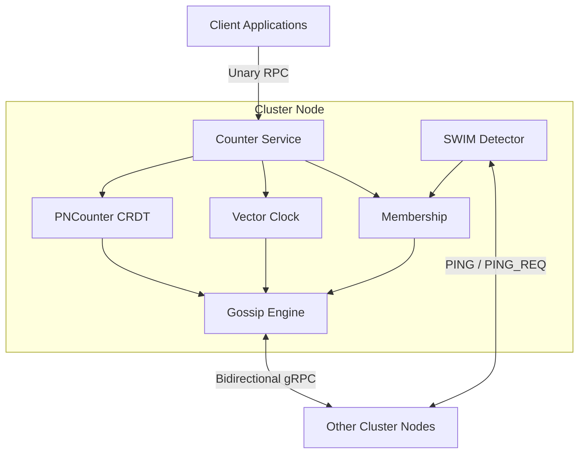
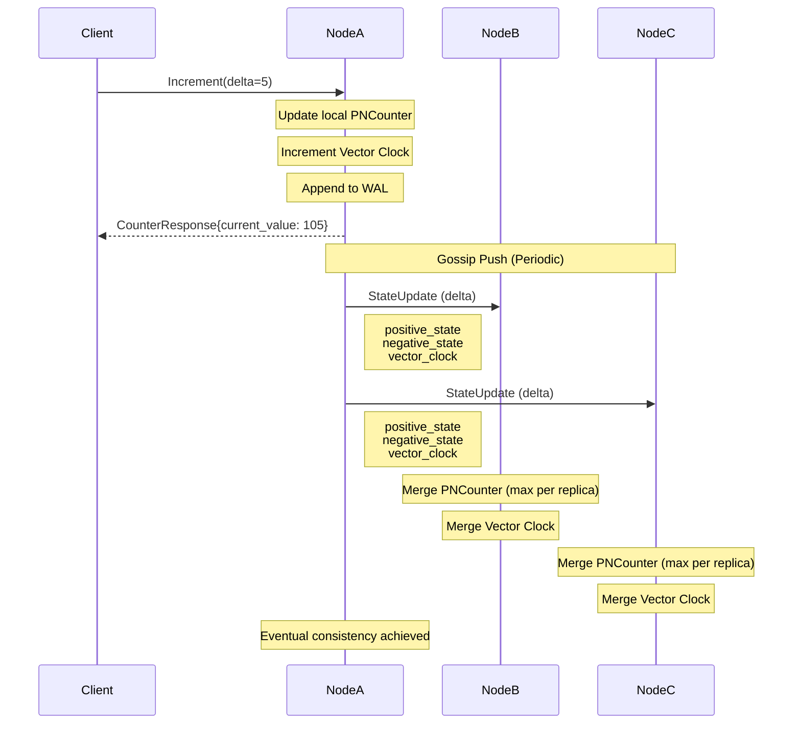
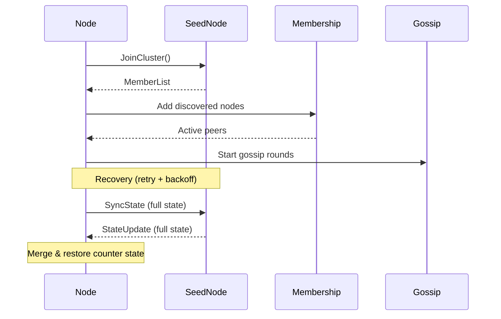
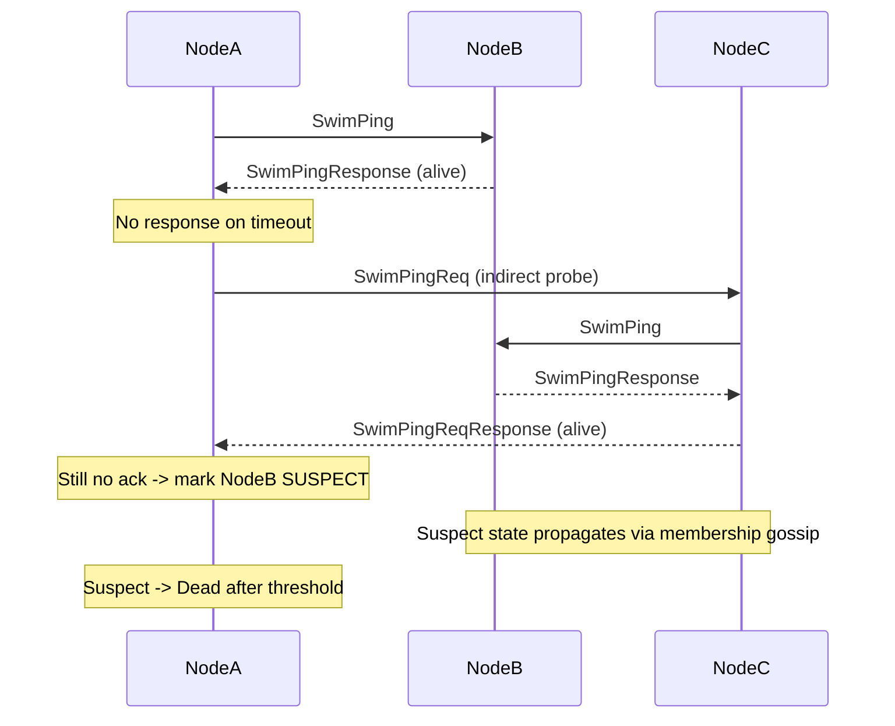

# Distributed Counter System with CRDT & gRPC

## Overview

Distributed Counter System adalah sistem counter terdistribusi yang memungkinkan multiple server nodes saling menyinkronkan nilai counter secara real-time tanpa memerlukan koordinator pusat. Sistem ini mengimplementasikan **Conflict-free Replicated Data Type (CRDT)** dan **Gossip Protocol** untuk mencapai **eventual consistency**, dengan semua komunikasi antar node menggunakan **gRPC**.

Sistem menggunakan:

* State-based **PNCounter CRDT**
* **Vector Clock** untuk causal ordering
* **Bidirectional gRPC Streaming** untuk sinkronisasi state
* **Gossip Protocol** untuk anti-entropy synchronization
* **SWIM** untuk failure detection
* **Write-Ahead Log (WAL)** + snapshot untuk durability
* **OpenTelemetry** untuk distributed tracing

---

## Features

| Feature                  | Description                                                                    |
| ------------------------ | ------------------------------------------------------------------------------ |
| CRDT-based Counter       | Menggunakan state-based `PNCounter` yang conflict-free                         |
| gRPC Communication       | Unary RPC, Server Streaming, dan Bidirectional Streaming                        |
| Gossip Protocol          | Sinkronisasi state secara periodik antar node                                  |
| Delta Gossip             | Hanya mengirim perubahan (delta) antar node, bukan full state                  |
| Versioned State          | Melacak `LastSyncVersion` per peer agar tidak mengirim state ganda             |
| Full-state Reconciliation| Kirim full state secara berkala sebagai jaring pengaman konsistensi            |
| Circuit Breaker          | Mencegah node mati dipukul terus pada setiap gossip round                      |
| SWIM Failure Detection   | Deteksi kegagalan dengan `PING`, `PING_REQ`, `ACK` dan status Suspect/Dead     |
| Membership Management    | Tracking lifecycle node (Alive/Suspect/Dead/Left) dengan heartbeat             |
| Service Discovery        | Bootstrap node menggunakan seed nodes                                          |
| State Recovery           | Pull state dari seed nodes saat startup dengan retry & backoff                 |
| Vector Clock             | Deteksi causal ordering dan conflict                                           |
| Fault Tolerance          | Tetap berjalan meskipun terjadi node failure atau network partition            |
| State Persistence        | Simpan state CRDT ke Redis agar counter survive restart                        |
| Write-Ahead Log          | Mutasi ditulis ke WAL sebelum diterapkan; di-replay saat restart               |
| Periodic Snapshots       | Snapshot berkala memangkas WAL agar tetap bounded                              |
| Reset RPC                | Reset counter untuk testing yang deterministik                                 |
| Authentication           | Proteksi RPC dengan API key (interceptor)                                     |
| Rate Limiting            | Batasi jumlah request per detik per method                                     |
| gRPC Compression         | Kompresi payload dengan gzip untuk menghemat bandwidth                         |
| Prometheus Metrics       | Monitoring counter, gossip, recovery, auth, dan rate limit                     |
| Distributed Tracing      | OpenTelemetry (OTLP) -> Jaeger, trace menyebar lintas node                     |
| Health Check             | gRPC health service + server reflection                                        |

---

# Architecture

## System Architecture


```mermaid
flowchart TD
    Client[Client Applications]

    Client -->|Unary RPC| CounterService

    subgraph Node["Cluster Node"]
        CounterService[Counter Service]

        CounterService --> PNCounter[PNCounter CRDT]
        CounterService --> VectorClock[Vector Clock]
        CounterService --> Membership[Membership]

        Membership --> Gossip[Gossip Engine]
        PNCounter --> Gossip
        VectorClock --> Gossip
        SWIM[SWIM Detector] --> Membership
    end

    Gossip <-->|Bidirectional gRPC| OtherNodes[Other Cluster Nodes]
    SWIM <-->|PING / PING_REQ| OtherNodes
```

---

## Counter Synchronization Flow


```mermaid
sequenceDiagram
    participant Client
    participant NodeA
    participant NodeB
    participant NodeC

    Client->>NodeA: Increment(delta=5)

    Note over NodeA: Update local PNCounter
    Note over NodeA: Increment Vector Clock
    Note over NodeA: Append to WAL

    NodeA-->>Client: CounterResponse{current_value: 105}

    Note over NodeA,NodeC: Gossip Push (Periodic)

    NodeA->>NodeB: StateUpdate (delta)
    Note right of NodeA: positive_state<br/>negative_state<br/>vector_clock

    NodeA->>NodeC: StateUpdate (delta)
    Note right of NodeA: positive_state<br/>negative_state<br/>vector_clock

    Note over NodeB: Merge PNCounter (max per replica)
    Note over NodeB: Merge Vector Clock

    Note over NodeC: Merge PNCounter (max per replica)
    Note over NodeC: Merge Vector Clock

    Note over NodeA: Eventual consistency achieved
```

---

## Internal Data Flow


```mermaid
flowchart LR
    A[Increment or Decrement] --> B[Update PNCounter]
    B --> C[Increment Vector Clock]
    C --> D[Append WAL]
    D --> E[Create StateUpdate]
    E --> F[Send via gRPC]
    F --> G[Remote Node]
    G --> H[Merge PNCounter]
    H --> I[Merge Vector Clock]
    I --> J[Eventual Consistency]
```

---

## Cluster Bootstrap & Recovery Flow


```mermaid
sequenceDiagram
    participant Node
    participant SeedNode
    participant Membership
    participant Gossip

    Node->>SeedNode: JoinCluster()
    SeedNode-->>Node: MemberList

    Node->>Membership: Add discovered nodes
    Membership-->>Node: Active peers

    Node->>Gossip: Start gossip rounds

    Note over Node,SeedNode: Recovery (retry + backoff)
    Node->>SeedNode: SyncState (full state)
    SeedNode-->>Node: StateUpdate (full state)
    Note over Node: Merge & restore counter state
```

---

## Failure Detection Flow (SWIM)


```mermaid
sequenceDiagram
    participant NodeA
    participant NodeB
    participant NodeC

    NodeA->>NodeB: SwimPing
    NodeB-->>NodeA: SwimPingResponse (alive)

    Note over NodeA: No response on timeout
    NodeA->>NodeC: SwimPingReq (indirect probe)
    NodeC->>NodeB: SwimPing
    NodeB-->>NodeC: SwimPingResponse
    NodeC-->>NodeA: SwimPingReqResponse (alive)

    Note over NodeA: Still no ack -> mark NodeB SUSPECT
    Note over NodeB,NodeC: Suspect state propagates via membership gossip
    Note over NodeA: Suspect -> Dead after threshold
```

---

# Technology Stack

| Technology       | Version   | Purpose                    |
| ---------------- | --------- | -------------------------- |
| Go               | 1.25+     | Main programming language  |
| gRPC             | 1.83      | RPC communication          |
| Protocol Buffers | 4.x       | Service definitions        |
| Redis            | 7.x       | State persistence          |
| Prometheus       | 2.45+     | Metrics                    |
| Grafana          | 10+       | Dashboard                  |
| Jaeger           | 1.57      | Distributed tracing (UI)   |
| OpenTelemetry    | 1.45      | Tracing SDK & OTLP export  |
| Docker           | 24+       | Containerization           |

---

## Go Libraries

| Library                                                            | Purpose                      |
| ------------------------------------------------------------------ | ---------------------------- |
| google.golang.org/grpc                                             | gRPC implementation          |
| google.golang.org/protobuf                                         | Protobuf serialization       |
| github.com/spf13/viper                                             | Configuration management     |
| go.uber.org/zap                                                    | Structured logging           |
| github.com/prometheus/client_golang                                | Metrics export               |
| github.com/redis/go-redis/v9                                       | Redis client                 |
| go.opentelemetry.io/otel                                           | OpenTelemetry SDK            |
| go.opentelemetry.io/otel/exporters/otlp/otlptrace/otlptracegrpc    | OTLP gRPC trace exporter     |
| go.opentelemetry.io/contrib/instrumentation/google.golang.org/grpc | gRPC tracing instrumentation |

---

# Project Structure

```text
distributed-counter/
├── api/
│   └── proto/
│       ├── counter.proto
│       ├── counter.pb.go
│       └── counter_grpc.pb.go
├── cmd/
│   └── server/
│       └── main.go
├── internal/
│   ├── cluster/        # Membership + SWIM failure detector
│   ├── config/         # Viper-based configuration
│   ├── crdt/           # PNCounter + Vector Clock
│   ├── gossip/         # Gossip engine (delta/full sync, circuit breaker)
│   ├── metrics/        # Prometheus metrics
│   ├── persistence/    # Redis store + Write-Ahead Log
│   ├── server/         # gRPC server (auth, rate limit, health, reflection)
│   ├── service/        # Counter service RPC handlers
│   └── tracing/        # OpenTelemetry init (OTLP -> Jaeger)
├── pkg/
│   ├── grpcutil/       # Shared dial options (auth, compression, tracing)
│   └── logger/
├── configs/
├── deployments/        # Dockerfile, compose, prometheus, grafana
├── scripts/
└── test/
    ├── integration/
    └── e2e/
```

---

# Getting Started

## Prerequisites

Install:

* Go 1.25+
* Protocol Buffers Compiler (`protoc`)
* Docker and Docker Compose (optional)

Verify installation:

```bash
go version
protoc --version
docker --version
docker compose version
```

---

# Install Protobuf Plugins

```bash
go install google.golang.org/protobuf/cmd/protoc-gen-go@latest
go install google.golang.org/grpc/cmd/protoc-gen-go-grpc@latest
```

Linux/macOS:

```bash
export PATH="$PATH:$(go env GOPATH)/bin"
```

Windows PowerShell:

```powershell
$env:Path += ";$(go env GOPATH)\bin"
```

---

# Generate Protobuf Files

Whenever `counter.proto` changes, regenerate the generated files.

Linux/macOS:

```bash
protoc \
  --go_out=. \
  --go-grpc_out=. \
  api/proto/counter.proto
```

Windows CMD:

```cmd
protoc ^
  --go_out=. ^
  --go-grpc_out=. ^
  api/proto/counter.proto
```

Generated files:

```text
api/proto/
├── counter.pb.go
└── counter_grpc.pb.go
```

---

# Configuration

Konfigurasi di-load dari file YAML (misal `configs/node1.yaml`). Log level dapat di-set via environment variable `COUNTER_LOG_LEVEL` (contoh: `debug`).

```yaml
# Identity
node_id: node-a
grpc_port: 50051
advertise_address: node-a:50051

# Metrics & HTTP
metrics_port: 8080
http_port: 8080

# Gossip & heartbeat
gossip_interval: 5            # detik antar gossip round
heartbeat_interval: 3         # detik antar heartbeat
heartbeat_timeout: 10         # detik sebelum node dianggap stale

# Persistence (Redis)
persistence_enabled: true
redis_addr: redis:6379
redis_password: ""
redis_db: 0

# Write-Ahead Log & snapshots
wal_enabled: true
wal_dir: data
snapshot_interval_seconds: 30

# SWIM failure detection
swim_interval: 1              # protocol period (detik)
swim_probe_timeout: 2         # timeout direct/indirect probe (detik)
swim_suspect_to_dead: 3       # jumlah probe gagal sebelum Suspect -> Dead

# Production features
auth_enabled: false           # true untuk menyalakan API key
api_key: ""                   # key yang harus dikirim client
rate_limit_per_second: 0      # 0 = unlimited
compression_enabled: true     # gzip pada payload gRPC

# Distributed tracing (OpenTelemetry -> Jaeger)
tracing_enabled: true
trace_endpoint: jaeger:4317   # OTLP gRPC collector
trace_sample_ratio: 1.0       # 0.0 - 1.0

# Bootstrap
seed_nodes:
  - node-b:50052
  - node-c:50053
```

### Node 1 (`configs/node1.yaml`)

```yaml
node_id: node-a
grpc_port: 50051
advertise_address: node-a:50051
metrics_port: 8080
http_port: 8080

seed_nodes:
  - node-b:50052
  - node-c:50053
```

### Node 2 (`configs/node2.yaml`)

```yaml
node_id: node-b
grpc_port: 50052
advertise_address: node-b:50052
metrics_port: 8081
http_port: 8081

seed_nodes:
  - node-a:50051
  - node-c:50053
```

### Node 3 (`configs/node3.yaml`)

```yaml
node_id: node-c
grpc_port: 50053
advertise_address: node-c:50053
metrics_port: 8082
http_port: 8082

seed_nodes:
  - node-a:50051
  - node-b:50052
```

---

# Running Locally

## Terminal 1

```bash
go run ./cmd/server --config configs/node1.yaml
```

## Terminal 2

```bash
go run ./cmd/server --config configs/node2.yaml
```

## Terminal 3

```bash
go run ./cmd/server --config configs/node3.yaml
```

---

# Docker

## Build Image

```bash
docker build -t distributed-counter .
```

---

## Run Single Node

```bash
docker run \
  -p 50051:50051 \
  distributed-counter
```

---

# Docker Compose Cluster

Cluster lengkap tersedia di `deployments/docker-compose.yml`. Service yang dijalankan:

| Service    | Description                                    |
| ---------- | ---------------------------------------------- |
| node-a/b/c | 3 node counter                                 |
| redis      | Persistence state counter                      |
| prometheus | Scrape metrics dari semua node                 |
| grafana    | Dashboard metrics (login: admin/admin)         |
| jaeger     | Distributed tracing UI (port 16686)            |

```yaml
services:
  node-a:
    build:
      context: ..
      dockerfile: deployments/Dockerfile
    command:
      - ./counter-server
      - -config
      - configs/node1.yaml
    ports:
      - "50051:50051"
      - "8080:8080" # Prometheus metrics
    networks:
      - counter-net

  node-b:
    build:
      context: ..
      dockerfile: deployments/Dockerfile
    command:
      - ./counter-server
      - -config
      - configs/node2.yaml
    ports:
      - "50052:50052"
      - "8081:8081"
    networks:
      - counter-net

  node-c:
    build:
      context: ..
      dockerfile: deployments/Dockerfile
    command:
      - ./counter-server
      - -config
      - configs/node3.yaml
    ports:
      - "50053:50053"
      - "8082:8082"
    networks:
      - counter-net

  redis:
    image: redis:7.0-alpine
    ports:
      - "6379:6379"
    volumes:
      - redis-data:/data
    networks:
      - counter-net

  prometheus:
    image: prom/prometheus:latest
    volumes:
      - ./prometheus.yml:/etc/prometheus/prometheus.yml
      - ./prometheus-rules.yml:/etc/prometheus/rules/prometheus-rules.yml
    ports:
      - "9090:9090"
    networks:
      - counter-net

  grafana:
    image: grafana/grafana:latest
    ports:
      - "3000:3000"
    environment:
      - GF_SECURITY_ADMIN_PASSWORD=admin
    volumes:
      - ./grafana-provisioning/datasources:/etc/grafana/provisioning/datasources
      - ./grafana-provisioning/dashboards:/etc/grafana/provisioning/dashboards
      - ./grafana-dashboards:/var/lib/grafana/dashboards
    networks:
      - counter-net

  jaeger:
    image: jaegertracing/all-in-one:1.57
    ports:
      - "16686:16686" # Jaeger UI
      - "4317:4317"   # OTLP gRPC
      - "4318:4318"   # OTLP HTTP
    environment:
      - COLLECTOR_OTLP_ENABLED=true
    networks:
      - counter-net

networks:
  counter-net:
    driver: bridge

volumes:
  redis-data:
```

Start cluster:

```bash
docker compose -f deployments/docker-compose.yml up --build
```

Run in background:

```bash
docker compose -f deployments/docker-compose.yml up -d --build
```

Stop cluster:

```bash
docker compose -f deployments/docker-compose.yml down
```

---

# Observability

## Prometheus & Grafana

* Prometheus UI: `http://localhost:9090`
* Grafana UI: `http://localhost:3000` (login `admin` / `admin`)
* Metrics endpoint tiap node: `http://localhost:808X/metrics`

## Distributed Tracing (Jaeger)

Tracing dikirim via OpenTelemetry Protocol (OTLP gRPC) ke Jaeger pada port `4317`.

* Jaeger UI: `http://localhost:16686`
* Service name di Jaeger: `distributed-counter`
* Setiap node diberi atribut `node.id` pada resource/span

Span yang ditrace:

| Span               | Sumber                                   |
| ------------------ | ---------------------------------------- |
| RPC server-side    | Semua RPC masuk (otelgrpc server handler)|
| RPC client-side    | Semua RPC keluar (otelgrpc client handler)|
| `counter.increment` | Operasi Increment                        |
| `counter.decrement` | Operasi Decrement                        |
| `counter.reset`     | Operasi Reset                            |
| `gossip.sync`       | Setiap gossip round ke peer              |

Trace context dipropagasi antar node (distributed tracing lintas proses).

---

# Development Workflow

## Update Dependencies

```bash
go mod tidy
```

---

## Regenerate Protobuf Files

Jalankan langkah ini setiap kali `api/proto/counter.proto` berubah.

### Linux/macOS

```bash
protoc \
  --go_out=. \
  --go-grpc_out=. \
  api/proto/counter.proto
```

### Windows CMD

```cmd
protoc ^
  --go_out=. ^
  --go-grpc_out=. ^
  api/proto/counter.proto
```

### Verify Generated Files

```bash
ls api/proto/
```

Expected:

```text
counter.proto
counter.pb.go
counter_grpc.pb.go
```

---

## Rebuild Docker Images

```bash
docker compose -f deployments/docker-compose.yml down
docker compose -f deployments/docker-compose.yml build --no-cache
docker compose -f deployments/docker-compose.yml up -d
```

---

## Verify Containers

```bash
docker compose -f deployments/docker-compose.yml ps
```

View logs:

```bash
docker compose -f deployments/docker-compose.yml logs -f
```

---

## Wait for Cluster Initialization

Linux/macOS:

```bash
sleep 5
```

Windows PowerShell:

```powershell
timeout /t 5
```

---

## Run Integration Tests

```bash
make test-integration
```

If you want to run the package directly after the cluster is already up:

```bash
go test -v ./test/integration/...
```

Windows PowerShell direct run:

```powershell
"%SystemRoot%\System32\WindowsPowerShell\v1.0\powershell.exe" -NoProfile -ExecutionPolicy Bypass -File scripts/test-integration.ps1
```

---

## Run End-to-End Tests

```bash
go test -v ./test/e2e/cluster_test.go
```

---

## Check Metrics

If metrics endpoint is enabled:

```bash
curl http://localhost:8080/metrics
```

Windows PowerShell:

```powershell
Invoke-WebRequest http://localhost:8080/metrics
```

---

## Stop Cluster

```bash
docker compose -f deployments/docker-compose.yml down
```

---

# Metrics

Prometheus metrics:

| Metric                          | Description                            |
| ------------------------------- | -------------------------------------- |
| counter_increment_total         | Total increment operations              |
| counter_decrement_total         | Total decrement operations              |
| counter_current_value           | Current counter value                   |
| gossip_messages_sent_total      | Total gossip messages sent              |
| gossip_messages_received_total  | Total gossip messages received          |
| recovery_retry_total            | Total retry recovery attempts           |
| recovery_seed_failures_total    | Failed recovery attempts per seed node  |
| recovery_sync_duration_seconds  | Duration of successful recovery sync    |
| recovery_in_progress            | Whether node is currently recovering    |
| rpc_rate_limited_total          | Requests rejected by rate limiter       |
| rpc_auth_rejected_total         | Requests rejected due to invalid auth   |

---

# Consistency Model

This project implements:

* State-based PNCounter CRDT
* Vector Clock
* Gossip Protocol
* SWIM Failure Detection
* Eventual Consistency

Properties:

* No leader election required
* No central coordinator required
* Partition tolerant
* Conflict-free merge semantics

---

# References

* https://crdt.tech/
* https://grpc.io/docs/languages/go/
* https://www.infoq.com/articles/gossip-protocols/
* https://en.wikipedia.org/wiki/Vector_clock
* https://hal.inria.fr/inria-00555588/document
* https://www.cs.cornell.edu/techreports/PDF/TR2007-2260.pdf (SWIM)
* https://opentelemetry.io/docs/languages/go/
* https://www.jaegertracing.io/

---

# Contributing

1. Fork repository.

2. Create feature branch.

```bash
git checkout -b feature/my-feature
```

3. Commit changes.

```bash
git commit -m "feat: add new feature"
```

4. Push branch.

```bash
git push origin feature/my-feature
```

5. Open Pull Request.

---

# License

This project is licensed under the MIT License.

---

# Acknowledgments

Inspired by distributed systems concepts used in large-scale systems at companies such as Google, Facebook, and Twitter.

Built with Go, gRPC, CRDT, and distributed systems concepts.